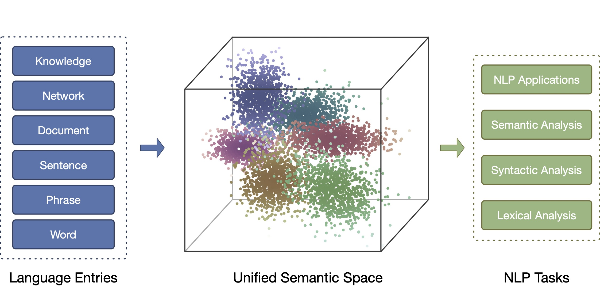

# Book: Representation Learning for Natural Language Processing, Second Edition

  <a href="#News">News</a> •
  <a href="#Abstract">Abstract</a> •
  <a href="#Download">Download</a> •
  <a href="#Contributors">Contributors</a> •
  <a href="#Updates">Updates</a> •
  <a href="#Citation">Citation</a>

## News

**Oct 07, 2022**: We have been working on the book's second edition since Aug 2022. We have released the drafts of nine chapters of the second edition. We will keep updating these chapters and release other chapters in the following months. All suggestions and comments are welcome.

## Abstract

This book provides an overview of the recent advances in representation learning theory, algorithms, and applications for natural language processing (NLP). It is divided into four parts. Part I presents the representation learning techniques for multiple language items, including words, phrases, sentences, and documents, as well as pre-training techniques. Part II then introduces the related representation techniques to NLP, including graphs, cross-modal entries, and robustness. Part III then introduces representation techniques for the knowledge closely related to NLP, including entity-based world knowledge, sememe-based linguistic knowledge, legal domain knowledge, and biomedical domain knowledge. Lastly, Part IV discusses the remaining challenges and future research directions.

The theories and algorithms of representation learning presented can also benefit other related domains such as machine learning, social network analysis, semantic Web, information retrieval, data mining, and computational biology. This book is intended for advanced undergraduate and graduate students, post-doctoral fellows, researchers, lecturers, industrial engineers, and anyone interested in representation learning and natural language processing.

As compared to the first edition, in the second edition, we (1) provide a more detailed introduction to representation learning in Chapter 1; (2) add four new chapters to introduce pre-trained language models, robust representation learning, legal knowledge representation learning and biomedical knowledge representation learning; (3) update recent advances in representation learning in all chapters; and (4) correct some errors in the first edition.

Distributed representation can provide unified semantic space for NLP

We welcome feedback, corrections, and suggestions to the book that can be posted as issues under this repository. We will keep updating the book according to your feedback and recent advances in representation learning.

## Download

### Second Edition

- Chapter 1: Representation Learning and NLP [<a href="2ed/1-intro.pdf" target="_blank">pdf</a>]  (update: Oct 07, 2022)
- Chapter 2: Word Representation Learning [<a href="2ed/2-word.pdf" target="_blank">pdf</a>]  (update: Oct 07, 2022)
- Chapter 3: Representation Learning for Compositional Semantics [<a href="2ed/3-comp.pdf" target="_blank">pdf</a>]  (update: Oct 07, 2022)
- Chapter 4: Sentence and Document Representation Learning [<a href="2ed/4-sent.pdf" target="_blank">pdf</a>]  (update: Oct 07, 2022)
- Chapter 5: Pre-trained Models for Representation Learning [TBA]
- Chapter 6: Graph Representation Learning [TBA]
- Chapter 7: Cross-Modal Representation Learning [<a href="2ed/7-modal.pdf" target="_blank">pdf</a>]  (update: Oct 07, 2022)
- Chapter 8: Robust Representation Learning [<a href="2ed/8-robust.pdf" target="_blank">pdf</a>]  (update: Oct 07, 2022)
- Chapter 9: Knowledge Representation Learning and Knowledge-guided NLP [TBA]
- Chapter 10: Sememe Knowledge Representation Learning [<a href="2ed/10-sememe.pdf" target="_blank">pdf</a>]  (update: Oct 07, 2022)
- Chapter 11: Legal Knowledge Representation Learning [<a href="2ed/11-legal.pdf" target="_blank">pdf</a>]  (update: Oct 07, 2022)
- Chapter 12: Biomedical Knowledge Representation Learning [<a href="2ed/12-bio.pdf" target="_blank">pdf</a>]  (update: Oct 07, 2022)
- Chapter 13: OpenBMB: Big Model Systems for Large-scale Representation Learning [TBA]
- Chapter 14: A 2023 Outlook for Representation Learning: Ten Key Problems of Pre-trained Models [TBA]

### First Edition

Book: [<a href="1ed/RL4NLP_1ed.pdf" target="_blank">pdf</a>] (update: Aug 25, 2022)

Table of Contents

- Chapter 1: Representation Learning and NLP
- Chapter 2: Word Representation
- Chapter 3: Compositional Semantics
- Chapter 4: Sentence Representation
- Chapter 5: Document Representation
- Chapter 6: Sememe Knowledge Representation
- Chapter 7: World Knowledge Representation
- Chapter 8: Network Representation
- Chapter 9: Cross-Modal Representation
- Chapter 10: Resources
- Chapter 11: Outlook

## Contributors

### Contributors of The Second Edition

Editors: Zhiyuan Liu, Yankai Lin, Maosong Sun

Authors: 
- Chapter 1: Zhiyuan Liu, Maosong Sun.
- Chapter 2: Shengding Hu, Zhiyuan Liu, Yankai Lin, Maosong Sun.
- Chapter 3: Ning Ding, Yankai Lin, Zhiyuan Liu, Maosong Sun.
- Chapter 4: Ning Ding, Yankai Lin, Zhiyuan Liu, Maosong Sun.
- Chapter 5: Yankai Lin, Ning Ding, Zhiyuan Liu, Maosong Sun.
- Chapter 6: Yankai Lin, Cheng Yang, Zhiyuan Liu, Maosong Sun.
- Chapter 7: Yuan Yao, Zhiyuan Liu, Maosong Sun.
- Chapter 8: Ganqu Cui, Yangyi Chen, Zhiyuan Liu, Maosong Sun.
- Chapter 9: Xu Han, Yuan Yao, Zhengyan Zhang, Weize Chen, Zhiyuan Liu, Maosong Sun.
- Chapter 10: Yujia Qin, Zhiyuan Liu, Maosong Sun.
- Chapter 11: Chaojun Xiao, Yuzhong Wang, Zhiyuan Liu, Maosong Sun.
- Chapter 12: Zheni Zeng, Chenyang Song, Zhiyuan Liu, Maosong Sun.
- Chapter 13: TBD.
- Chapter 14: TBD.

### Contributors of The First Edition

As mentioned in the Acknowledgements of the first edition, updated on Aug 25, 2022. The authors are very grateful for the contributions of our students and research collaborators, who have prepared initial drafts of some chapters or have given us comments, suggestions, and corrections. We list the main contributors for preparing initial drafts of each chapter as follows,

- Chapter 1: Tianyu Gao, Zhiyuan Liu.
- Chapter 2: Lei Xu, Yankai Lin.
- Chapter 3: Yankai Lin, Yang Liu.
- Chapter 4: Yankai Lin, Zhengyan Zhang, Cunchao Tu, Hongyin Luo.
- Chapter 5: Yankai Lin, Zhenghao Liu, Haozhe Ji.
- Chapter 6: Fanchao Qi, Chenghao Yang.
- Chapter 7: Ruobing Xie, Xu Han.
- Chapter 8: Cheng Yang, Jie Zhou, Zhengyan Zhang.
- Chapter 9: Ji Xin, Yuan Yao, Deming Ye, Hao Zhu.
- Chapter 10: Xu Han, Zhengyan Zhang, Cheng Yang.
- Chapter 11: Cheng Yang, Zhiyuan Liu.

For the whole book, we thank Chaojun Xiao and Zhengyan Zhang for drawing model figures, thank Chaojun Xiao for unifying the styles of figures and tables in the book, thank Shengding Hu for making the notation table and unifying the notations across chapters, thank Jingcheng Yuzhi and Chaojun Xiao for organizing the format of reference, thank Jingcheng Yuzhi, Jiaju Du, Haozhe Ji, Sicong Ouyang and Ayana for the first-round proofreading, and thank Weize Chen, Ganqu Cui, Bowen Dong, Tianyu Gao, Xu Han, Zhenghao Liu, Fanchao Qi, Guangxuan Xiao, Cheng Yang, Yuan Yao, Shi Yu, Yuan Zang, Zhengyan Zhang, Haoxi Zhong and Jie Zhou for the second-round proofreading. We also thank Cuncun Zhao for designing the book cover.

## Updates

**Oct 07, 2022**: We have been working on the book's second edition since Aug 2022. We have released the drafts of nine chapters of the second edition. We will keep updating these chapters and release other chapters in the following months.

**Aug 25, 2022**: Correction. We found some contents in a chapter duplicate with others' articles and confirmed all these contents are from the initial draft prepared by a research assistant in our team in 2017, who was acknowledged as a critical contributor to this chapter in the 2020 edition. The author team is responsible for failing to prevent it from happening, and we sincerely apologize for this incident. We did not keep alert enough to potential misconduct. We thus did not find the duplicate issue even after several rounds of revision and proofreading and finally included the duplicate contents unintentionally into the 2020 edition. We will try our best to make the case never happen again by writing and proofreading more carefully and applying duplicate detection to each material to be released by our team in the future. We have requested the publisher to retract the corresponding chapter, but it may take some time to complete the process. We have replaced all these contents with a new and shorter summary and also removed the research assistant from acknowledgments.

**Jul 03, 2020**. The first edition is published in Springer as an Open Access book.

The first-edition book cover.

## Citation

@book{liu2023representation, \
  title = {Representation Learning for Natural Language Processing, Second Edition}, \
  editor= {Liu, Zhiyuan and Lin, Yankai and Sun, Maosong},\
  year=   {2023},\
  url=    { https://github.com/thunlp/Book_RL4NLP }, \
}
