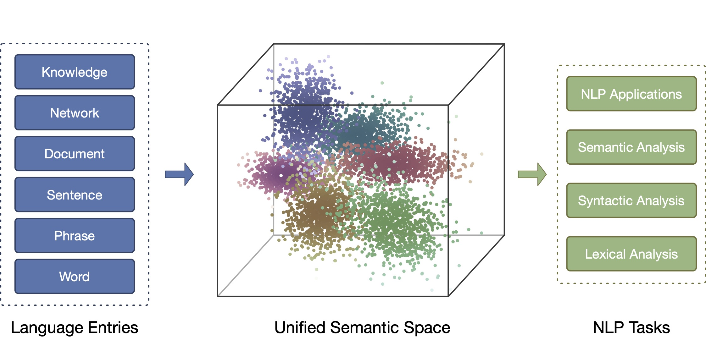
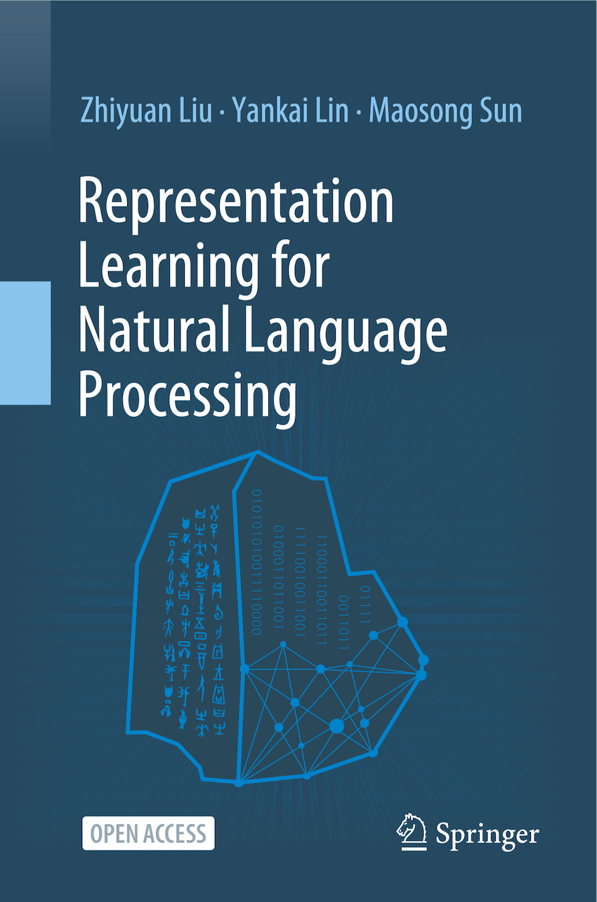

# Book: Representation Learning for Natural Language Processing

  <a href="#Abstract">Download</a> •
  <a href="#Abstract">Abstract</a> •
  <a href="#Authors">Authors</a> •
  <a href="#Updates">Updates</a> •
  <a href="#Updates">Table of Contents</a> •
  <a href="#Updates">Citation</a>

## Download

[<a href="https://github.com/thunlp/Book_RL4NLP/raw/main/RL4NLP.pdf" target="_blank">pdf</a>] (update: Aug 22, 2022)

We welcome feedback, corrections, and suggestions to the book that can be posted as issues under this repository. We will keep updating the book here, according to your feedback and recent advances in representation learning.

## Abstract

This book provides an overview of the recent advances in representation learning theory, algorithms and applications for natural language processing (NLP). It is divided into three parts. Part I presents the representation learning techniques for multiple language entries, including words, phrases, sentences and documents. Part II then introduces the representation techniques for those objects that are closely related to NLP, including entity-based world knowledge, sememe-based linguistic knowledge, networks, and cross-modal entries. Lastly, Part III provides open resource tools for representation learning techniques, and discusses the remaining challenges and future research directions.

The theories and algorithms of representation learning presented can also benefit other related domains such as machine learning, social network analysis, semantic Web, information retrieval, data mining and computational biology. This book is intended for advanced undergraduate and graduate students, post-doctoral fellows, researchers, lecturers, and industrial engineers, as well as anyone interested in representation learning and natural language processing.

Distributed representation can provide unified semantic space for NLP

## Authors

**Zhiyuan Liu** is an Associate Professor at the Department of Computer Science and Technology at Tsinghua University, China. His research interests include representation learning and knowledge graphs, and he has published more than 100 papers at leading conferences and journals. He has served as area chair for various conferences, including ACL, EMNLP, WWW, CIKM, COLING.

**Yankai Lin** is a senior researcher at the Pattern Recognition Center, Tencent Wechat. He received his Ph.D. degree in Computer Science from Tsinghua in 2019. His research interests include representation learning, information extraction and question answering. He has published more than 30 papers at international conferences, including ACL, EMNLP, IJCAI and AAAI. He was named an Academic Rising Star of Tsinghua University and a Baidu Scholar.

**Maosong Sun** is a Professor at the Department of Computer Science and Technology and the Executive Vice Dean of the Institute for Artificial Intelligence, Tsinghua University. His research interests include natural language processing, machine learning, computational humanities and social sciences. He is the chief scientist of the National Key Basic Research and Development Program (973 Program), the chief expert of various major National Social Science Fund of China projects, and a member of The Academy of Europe. He has published over 200 papers at leading conferences and journals. He is the Director of Tsinghua University-National University of Singapore Joint Research Center on Next Generation Search Technologies, and the editor-in-chief of the Journal of Chinese Information Processing.

**Other Contributors** (mentioned in Acknowledgements of the book, updated on Aug 18, 2022). The authors are very grateful to the contributions of our students and research collaborators, who have prepared initial drafts of some chapters or have given us comments, suggestions, and corrections. We list main contributors for preparing initial drafts of each chapter as follows,

- Chapter 1: Tianyu Gao, Zhiyuan Liu.
- Chapter 2: Lei Xu, Yankai Lin.
- Chapter 3: Yankai Lin, Yang Liu.
- Chapter 4: Yankai Lin, Zhengyan Zhang, Cunchao Tu, Hongyin Luo.
- Chapter 5: Yankai Lin, Zhenghao Liu, Haozhe Ji.
- Chapter 6: Fanchao Qi, Chenghao Yang.
- Chapter 7: Ruobing Xie, Xu Han.
- Chapter 8: Cheng Yang, Jie Zhou, Zhengyan Zhang.
- Chapter 9: Ji Xin, Yuan Yao, Deming Ye, Hao Zhu.
- Chapter 10: Xu Han, Zhengyan Zhang, Cheng Yang.
- Chapter 11: Cheng Yang, Zhiyuan Liu.

For the whole book, we thank Chaojun Xiao and Zhengyan Zhang for drawing model figures, thank Chaojun Xiao for unifying the styles of figures and tables in the book, thank Shengding Hu for making the notation table and unifying the notations across chapters, thank Jingcheng Yuzhi and Chaojun Xiao for organizing the format of reference, thank Jingcheng Yuzhi, Jiaju Du, Haozhe Ji, Sicong Ouyang and Ayana for the first-round proofreading, and thank Weize Chen, Ganqu Cui, Bowen Dong, Tianyu Gao, Xu Han, Zhenghao Liu, Fanchao Qi, Guangxuan Xiao, Cheng Yang, Yuan Yao, Shi Yu, Yuan Zang, Zhengyan Zhang, Haoxi Zhong and Jie Zhou for the second-round proofreading. We also thank Cuncun Zhao for designing the book cover.

## Updates

**Aug 22, 2022** Correction: We find duplicated contents with others' articles and confirm all are from the initial draft prepared by a research assistant in our team in 2017, who was acknowledged as a key contributor in the 2020 edition. The author team is responsible for failing to prevent this issue from happening. We did not keep alert enough to potential misconduct, and thus did not find the duplicate issue even after several rounds of revision and proofreading and finally included the duplicate contents unintentionally into the 2020 edition. We sincerely apologize for the duplicate issue. We will try our best to make the case never happen again, by writing and proofreading more carefully, and applying duplicate detection to each material released by our team in the future. We have requested the publisher to retract the corresponding chapter, but it may take some time to complete the process. In this online version, we have replaced all these contents with a new and shorter summary, and also removed the research assistant from acknowledgements.

**Jul 03, 2020** The first edition is published in Springer as an Open Access book.

The first-edition book cover.

## Table of Contents

- Preface
- Acknowledgments
- Chapter 1: Representation Learning and NLP
- Chapter 2: Word Representation
- Chapter 3: Compositional Semantics
- Chapter 4: Sentence Representation
- Chapter 5: Document Representation
- Chapter 6: Sememe Knowledge Representation
- Chapter 7: World Knowledge Representation
- Chapter 8: Network Representation
- Chapter 9: Cross-Modal Representation
- Chapter 10: Resources
- Chapter 11: Outlook

## Citation

@book{liu2022representation, \
  title={Representation Learning for Natural Language Processing}, \
  author={Liu, Zhiyuan and Lin, Yankai and Sun, Maosong},\
  year={2022},\
  url={ https://github.com/thunlp/Book_RL4NLP }, \
}
